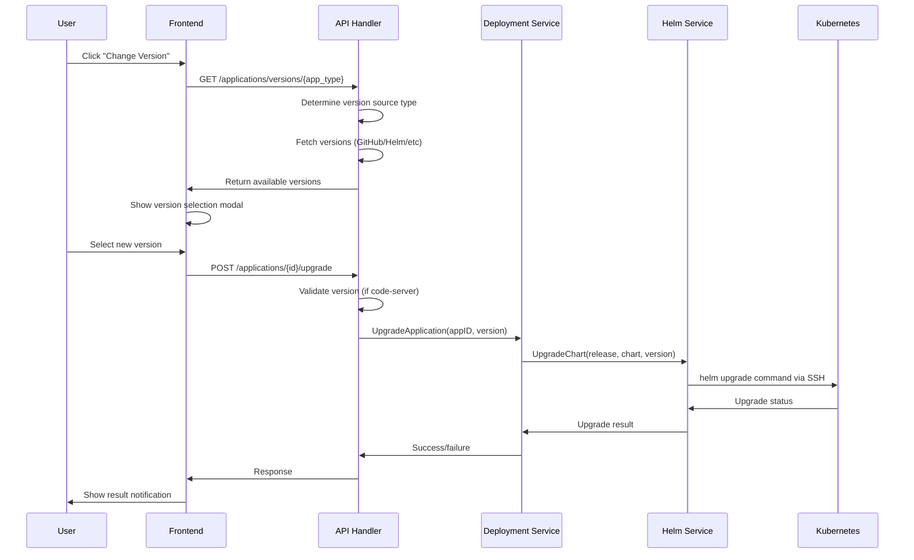
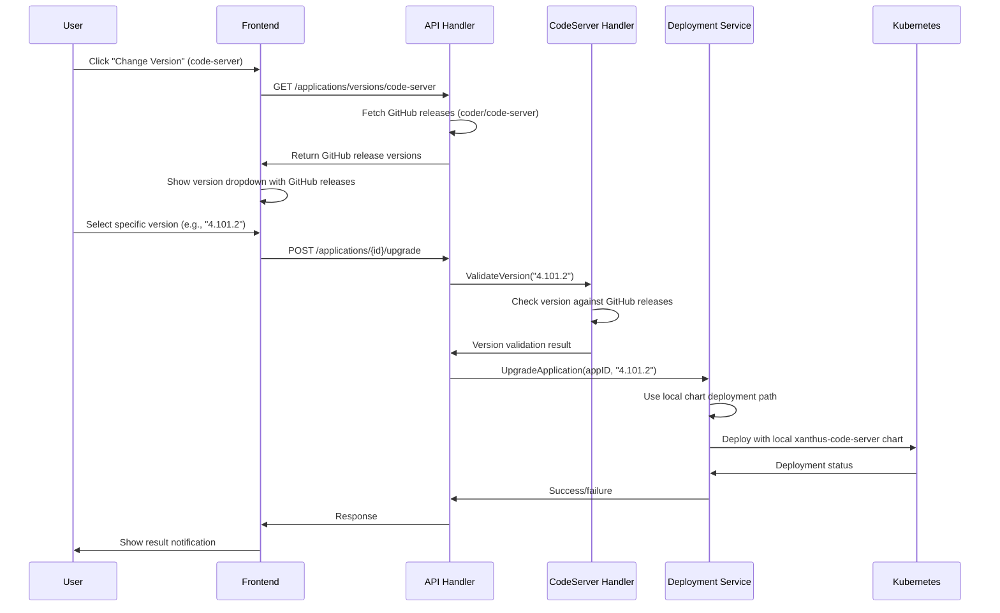

# Xanthus Version Management System

## Overview

This document provides a comprehensive analysis of how Xanthus manages version changes across different application types, including the unique approaches for different applications and the extensible architecture that supports multiple version sources.

## Table of Contents

1. [Architecture Overview](#architecture-overview)
2. [Application Types and Version Sources](#application-types-and-version-sources)
3. [Code-Server's Unique Approach](#code-servers-unique-approach)
4. [Version Detection Implementation](#version-detection-implementation)
5. [Frontend Implementation](#frontend-implementation)
6. [Backend API Architecture](#backend-api-architecture)
7. [Configuration-Driven System](#configuration-driven-system)
8. [Upgrade Process Flow](#upgrade-process-flow)
9. [Security Considerations](#security-considerations)
10. [Extension Patterns](#extension-patterns)
11. [Future Enhancements](#future-enhancements)

## Architecture Overview

Xanthus implements a **multi-tier version management system** that supports different version sources and application-specific upgrade logic:

```
┌─────────────────┐    ┌──────────────────┐    ┌─────────────────┐
│   Frontend UI   │    │   Backend API    │    │ Version Sources │
│                 │    │                  │    │                 │
│ ┌─────────────┐ │    │ ┌──────────────┐ │    │ ┌─────────────┐ │
│ │Change Version│ │    │ │Version       │ │    │ │GitHub API   │ │
│ │Modal        │ │───▶│ │Detection     │ │───▶│ │Helm Repos   │ │
│ │             │ │    │ │Handler       │ │    │ │Docker Hub   │ │
│ └─────────────┘ │    │ └──────────────┘ │    │ │Static       │ │
│                 │    │                  │    │ └─────────────┘ │
│ ┌─────────────┐ │    │ ┌──────────────┐ │    │                 │
│ │Application  │ │    │ │Application   │ │    │                 │
│ │Upgrade      │ │    │ │Deployment    │ │    │                 │
│ │Interface    │ │    │ │Service       │ │    │                 │
│ └─────────────┘ │    │ └──────────────┘ │    │                 │
└─────────────────┘    └──────────────────┘    └─────────────────┘
```

### Key Architectural Principles

1. **Configuration-Driven**: Version sources defined in YAML configuration files
2. **Type-Based Namespaces**: Applications grouped by type for clean resource management
3. **Pluggable Version Sources**: Support for GitHub, Helm, Docker Hub, and static sources
4. **Application-Specific Logic**: Special handling for applications like code-server
5. **Extensible Framework**: Easy to add new version sources and application types

## Application Types and Version Sources

### Current Application Catalog

| Application | Category | Version Source Type | Repository/Source | Special Features |
|-------------|----------|-------------------|------------------|------------------|
| **code-server** | Development | GitHub | `coder/code-server` | Password mgmt, Local charts, VS Code config |
| **open-webui** | AI/ML | GitHub | `open-webui/open-webui` | Standard deployment |
| **xanthus** | DevOps | GitHub | `chrishham/xanthus` | Self-update capabilities, Update policies |
| **argocd** | DevOps | Helm | `https://argoproj.github.io/argo-helm` | GitOps deployment |
| **headlamp** | DevOps | Helm | `https://kubernetes-sigs.github.io/headlamp/` | Kubernetes UI |

### Version Source Configuration Structure

```yaml
version_source:
  type: github|helm|dockerhub|static
  source: "owner/repository" | "helm-repo-url" | "dockerhub-repo"
  pattern: "v*"  # Optional for GitHub (regex pattern for releases)
  chart: "chart-name"  # Required for helm type
```

### Supported Version Source Types

#### 1. GitHub Version Source
```yaml
version_source:
  type: github
  source: coder/code-server
  pattern: "v*"
```

**Capabilities:**
- Fetches releases from GitHub Releases API
- Supports pre-release detection
- Automatic Docker tag conversion (removes "v" prefix)
- Rate limiting awareness
- Release notes and URLs

#### 2. Helm Version Source
```yaml
version_source:
  type: helm
  source: https://argoproj.github.io/argo-helm
  chart: argo-cd
```

**Capabilities:**
- Parses Helm repository index.yaml (planned)
- Currently returns basic stable/latest options
- Chart version tracking
- Repository index caching (planned)

#### 3. Docker Hub Version Source (Planned)
```yaml
version_source:
  type: dockerhub
  source: library/nginx
```

#### 4. Static Version Source (Planned)
```yaml
version_source:
  type: static
  source: "1.0.0"
```

## Code-Server's Unique Approach

Code-Server receives **special treatment** throughout the system due to its unique requirements for security and user experience:

### 🔐 Password Management Strategy

**Code-Server (Unique Approach):**
```go
// NEVER stores passwords in KV store for security
// Always retrieves on-demand from pod configuration
func (h *Handler) getCodeServerPassword(vpsConn *services.SSHConnection, app *models.Application) (string, error) {
    // Direct retrieval from pod config file
    cmd := fmt.Sprintf("kubectl exec -n %s %s -- cat /home/coder/.config/code-server/config.yaml", 
                      app.Namespace, podName)
    result, err := sshService.ExecuteCommand(vpsConn, cmd)
    // Parse YAML and extract password
    return extractPasswordFromYAML(result.Output)
}
```

**Other Applications (Standard Approach):**
```go
// Store encrypted passwords in KV store for faster access
func (h *Handler) getApplicationPassword(app *models.Application) (string, error) {
    kvService := services.NewKVService()
    // Try KV store first (encrypted storage)
    password, err := kvService.GetValue(token, accountID, passwordKey)
    if err != nil {
        // Fallback to pod retrieval, then cache result
        password = retrieveFromPod(app)
        kvService.PutValue(token, accountID, passwordKey, encryptedPassword)
    }
    return password, nil
}
```

### 🔧 Version Validation

**Code-Server Specific Validation:**
```go
// Location: internal/handlers/applications/http.go:252-265
if app.AppType == string(TypeCodeServer) && upgradeData.Version != "latest" {
    codeServerHandler := NewCodeServerHandlers()
    valid, err := codeServerHandler.ValidateVersion(upgradeData.Version)
    if err != nil {
        log.Printf("Error validating version: %v", err)
        c.JSON(http.StatusInternalServerError, gin.H{"error": "Failed to validate version"})
        return
    }
    if !valid {
        c.JSON(http.StatusBadRequest, gin.H{"error": "Invalid version specified"})
        return
    }
}
```

### 🚀 Deployment Strategy

**Code-Server Conditional Logic:**
```go
// Location: internal/services/application_service_deployment.go
if predefinedApp.ID == "code-server" && helmConfig.Repository == "local" {
    // Special deployment path for code-server
    deployErr = ads.deployCodeServerWithLocalChart(
        token, accountID, application, predefinedApp, helmConfig, domain, subdomain, vpsID)
} else {
    // Standard deployment for other applications
    deployErr = ads.deployWithExternalChart(
        token, accountID, application, predefinedApp, helmConfig, domain, subdomain, vpsID)
}
```

### 📁 Configuration Management

**Code-Server Features:**
- **Local Helm Charts**: Uses `repository: local` instead of external repositories
- **ConfigMap Creation**: Automatic VS Code settings and setup scripts
- **Per-instance Settings**: Individual ConfigMaps for each code-server instance
- **Shared Setup Scripts**: Namespace-level setup script ConfigMaps

## Version Detection Implementation

### Backend Service Architecture

```go
// Enhanced version service interface
type EnhancedVersionService interface {
    GetLatestVersion(appID string) (*models.VersionInfo, error)
    RefreshVersion(appID string) error
    GetVersionHistory(appID string) ([]models.VersionInfo, error)
    GetVersionSource(appID string) (*models.VersionSource, error)
}

// Version source factory pattern
type VersionSourceFactory interface {
    CreateVersionSource(sourceType string) (VersionSource, error)
}

// Individual version source implementations
type GitHubVersionSource struct {
    client *github.Client
    rateLimiter *rate.Limiter
}

type HelmVersionSource struct {
    httpClient *http.Client
    indexCache map[string]*HelmIndex
}
```

### Version Source Implementations

#### GitHub Version Source
**Location**: `internal/handlers/applications/http.go:660-700`

```go
func (h *Handler) fetchGitHubVersions(source, appType string) ([]models.VersionInfo, error) {
    githubService := services.NewGitHubService()
    
    // Parse owner/repo from source
    parts := strings.Split(source, "/")
    owner, repo := parts[0], parts[1]
    
    // Fetch up to 20 latest releases
    releases, err := githubService.GetReleases(owner, repo, 20)
    if err != nil {
        return nil, fmt.Errorf("failed to fetch GitHub releases: %v", err)
    }
    
    // Convert to standardized VersionInfo format
    var versions []models.VersionInfo
    for i, release := range releases {
        dockerTag := strings.TrimPrefix(release.TagName, "v") // Remove "v" prefix
        versionInfo := models.VersionInfo{
            Version:     dockerTag,
            Name:        release.Name,
            IsLatest:    i == 0,
            IsStable:    !release.Prerelease,
            PublishedAt: release.PublishedAt,
            URL:         release.HTMLURL,
        }
        versions = append(versions, versionInfo)
    }
    return versions, nil
}
```

#### Helm Version Source
**Location**: `internal/handlers/applications/http.go:702-732`

```go
func (h *Handler) fetchHelmVersions(source, chart, appType string) ([]models.VersionInfo, error) {
    // Current basic implementation
    versions := []models.VersionInfo{
        {
            Version:  "stable",
            Name:     "Stable Version",
            IsLatest: true,
            IsStable: true,
        },
        {
            Version:  "latest",
            Name:     "Latest Version", 
            IsLatest: false,
            IsStable: true,
        },
    }
    
    // TODO: Implement proper Helm repository parsing
    // 1. Fetch repository index.yaml file
    // 2. Parse chart versions and metadata
    // 3. Return structured version information
    
    return versions, nil
}
```

### Version Detection Handler

**Location**: `internal/handlers/applications/http.go:282-336`

```go
func (h *Handler) HandleApplicationVersions(c *gin.Context) {
    appType := c.Param("app_type")
    
    // Get application configuration from catalog
    predefinedApp, exists := h.catalog.GetApplicationByID(appType)
    if !exists {
        c.JSON(http.StatusBadRequest, gin.H{
            "success": false,
            "error":   "Invalid application type",
        })
        return
    }
    
    // Check version source configuration
    if predefinedApp.VersionSource.Type == "" {
        c.JSON(http.StatusBadRequest, gin.H{
            "success": false,
            "error":   "Version lookup not supported for this application type",
        })
        return
    }
    
    var versions []models.VersionInfo
    var err error
    
    // Route to appropriate version source handler
    switch predefinedApp.VersionSource.Type {
    case "github":
        versions, err = h.fetchGitHubVersions(predefinedApp.VersionSource.Source, appType)
    case "helm":
        versions, err = h.fetchHelmVersions(predefinedApp.VersionSource.Source, 
                                          predefinedApp.VersionSource.Chart, appType)
    default:
        c.JSON(http.StatusBadRequest, gin.H{
            "success": false,
            "error":   fmt.Sprintf("Version source type '%s' not supported", 
                                 predefinedApp.VersionSource.Type),
        })
        return
    }
    
    if err != nil {
        log.Printf("Error fetching %s versions: %v", appType, err)
        c.JSON(http.StatusInternalServerError, gin.H{
            "success": false,
            "error":   "Failed to fetch version information",
        })
        return
    }
    
    c.JSON(http.StatusOK, models.VersionsResponse{
        Success:  true,
        Versions: versions,
    })
}
```

## Frontend Implementation

### Version Selection Modal

**Location**: `web/static/js/modules/applications-management.js:594-668`

```javascript
async showUpgradeModal(app) {
    // Dynamic version fetching for any application type
    let versionsHtml = '';
    try {
        const versionsResponse = await fetch(`/applications/versions/${app.app_type}`);
        if (versionsResponse.ok) {
            const versionsData = await versionsResponse.json();
            if (versionsData.success && versionsData.versions.length > 0) {
                // Build version dropdown options
                const options = versionsData.versions.map(v => 
                    `<option value="${v.version}" ${v.is_latest ? 'selected' : ''}>
                        ${v.version}${v.is_latest ? ' (Latest)' : ''}${!v.is_stable ? ' (Pre-release)' : ''}
                     </option>`
                ).join('');
                
                versionsHtml = `
                    <select id="version-select" class="swal2-input m-0 w-full">
                        <option value="latest">latest (Automatic)</option>
                        ${options}
                    </select>
                `;
            }
        }
    } catch (error) {
        console.warn(`Failed to fetch versions for ${app.app_type}:`, error);
    }
    
    // Show modal only if versions are available
    if (!versionsHtml) {
        Swal.fire({
            title: 'Version Change Not Available',
            text: 'Version selection is only available for applications that support automatic version detection.',
            icon: 'info',
            confirmButtonText: 'OK',
            confirmButtonColor: '#2563eb'
        });
        return;
    }
    
    // Display version selection modal
    const { value: newVersion } = await Swal.fire({
        title: 'Change Application Version',
        html: `
            <div class="text-left">
                <p class="mb-4">Change <strong>${app.name}</strong> to a different version:</p>
                <div class="mb-4">
                    <label class="block text-sm font-medium text-gray-700 mb-1">Current Version:</label>
                    <div class="p-2 bg-gray-100 rounded text-sm">${app.app_version}</div>
                </div>
                <div>
                    <label class="block text-sm font-medium text-gray-700 mb-1">New Version:</label>
                    ${versionsHtml}
                </div>
            </div>
        `,
        showCancelButton: true,
        confirmButtonText: 'Change Version',
        confirmButtonColor: '#2563eb',
        preConfirm: () => {
            const versionSelect = document.getElementById('version-select');
            const version = versionSelect?.value;
            
            if (!version) {
                Swal.showValidationMessage('Version is required');
                return false;
            }
            return version;
        }
    });
    
    if (newVersion) {
        await this.upgradeApplication(app.id, newVersion);
    }
}
```

### Modal Features

1. **Dynamic Version Loading**: Automatically fetches available versions based on app type
2. **Version Dropdown**: Shows available versions with status indicators (Latest, Pre-release)
3. **Graceful Fallbacks**: Shows informative message for unsupported applications
4. **Current Version Display**: Shows the currently deployed version for reference
5. **Validation**: Ensures a version is selected before proceeding
6. **SweetAlert2 Integration**: Polished modal experience with consistent styling

## Backend API Architecture

### API Routes

**Location**: `internal/router/routes.go:154-155`

```go
// Version detection endpoint
apps.GET("/versions/:app_type", config.AppsHandler.HandleApplicationVersions)

// Application upgrade endpoint  
apps.POST("/:id/upgrade", config.AppsHandler.HandleApplicationUpgrade)
```

### Application Upgrade Handler

**Location**: `internal/handlers/applications/http.go:229-280`

```go
func (h *Handler) HandleApplicationUpgrade(c *gin.Context) {
    token := c.GetString("cf_token")
    accountID := c.GetString("account_id")
    appID := c.Param("id")
    
    var upgradeData struct {
        Version string `json:"version"`
    }
    
    if err := c.ShouldBindJSON(&upgradeData); err != nil {
        c.JSON(http.StatusBadRequest, gin.H{"error": "Invalid request data"})
        return
    }
    
    // Get application details
    appHelper := NewApplicationHelper()
    app, err := appHelper.GetApplicationByID(token, accountID, appID)
    if err != nil {
        c.JSON(http.StatusNotFound, gin.H{"error": "Application not found"})
        return
    }
    
    // Special validation for code-server applications
    if app.AppType == string(TypeCodeServer) && upgradeData.Version != "latest" {
        codeServerHandler := NewCodeServerHandlers()
        valid, err := codeServerHandler.ValidateVersion(upgradeData.Version)
        if err != nil {
            log.Printf("Error validating version: %v", err)
            c.JSON(http.StatusInternalServerError, gin.H{"error": "Failed to validate version"})
            return
        }
        if !valid {
            c.JSON(http.StatusBadRequest, gin.H{"error": "Invalid version specified"})
            return
        }
    }
    
    // Perform upgrade using deployment service
    deploymentService := services.NewApplicationDeploymentService()
    err = deploymentService.UpgradeApplication(token, accountID, appID, upgradeData.Version)
    if err != nil {
        log.Printf("Error upgrading application: %v", err)
        c.JSON(http.StatusInternalServerError, gin.H{"error": "Failed to upgrade application"})
        return
    }
    
    c.JSON(http.StatusOK, gin.H{
        "success": true,
        "message": SuccessMessages.ApplicationUpdated,
    })
}
```

## Configuration-Driven System

### Application Configuration Structure

Each application is defined by a YAML configuration file in `configs/applications/`:

```yaml
# Example: configs/applications/code-server.yaml
id: code-server
name: Code Server
description: VS Code in your browser - a full development environment accessible from anywhere
icon: 💻
category: Development

# Version source configuration
version_source:
  type: github
  source: coder/code-server
  pattern: "v*"

# Helm chart configuration
helm_chart:
  repository: local  # Special: uses local charts
  chart: xanthus-code-server
  version: 1.0.0
  namespace: code-server
  values_template: code-server.yaml
  placeholders:
    APPLICATION_VERSION: "{{.Version}}"

# Resource requirements
requirements:
  min_cpu: 0.5
  min_memory_gb: 1
  min_disk_gb: 10

# Application features
features:
  - Full VS Code experience in browser
  - Git integration
  - Terminal access
  - Extension support
  - Docker integration
  - Persistent workspace (10GB)
```

### Advanced Configuration: Xanthus Update Policy

**Location**: `configs/applications/xanthus.yaml:25-37`

```yaml
# Update strategy configuration (planned feature)
update_policy:
  strategy: manual              # User chooses version (like code-server)
  auto_patch: false            # Don't auto-update patch versions
  auto_minor: false            # Don't auto-update minor versions  
  auto_major: false            # Never auto-update major versions
  rollback_enabled: true       # Enable rollback functionality

ui_features:
  show_release_notes: true     # Display changelog for selected version
  allow_downgrade: true        # Let users downgrade if needed
  require_confirmation: true   # Confirm before updates
  show_current_version: true   # Display currently running version
```

**Note**: These update policy features are configured but not yet implemented in the codebase.

## Upgrade Process Flow

### Standard Application Upgrade Flow



### Code-Server Specific Upgrade Flow



## Security Considerations

### Password Management Security

1. **Code-Server Password Security**:
   - Passwords **never stored** in KV store
   - Always retrieved **on-demand** from pod configuration
   - Supports **user password changes** without system involvement
   - **Memory-only** password handling

2. **Other Applications**:
   - Passwords **encrypted** before KV store storage
   - **Token-based encryption** using Cloudflare tokens
   - **Caching strategy** for performance with security

### Version Validation Security

1. **Input Validation**:
   - Version strings validated against source repositories
   - **Semantic version** format checking
   - **Injection attack** prevention

2. **Source Verification**:
   - GitHub releases verified against **official repositories**
   - Helm charts validated against **trusted repositories**
   - **Rate limiting** on external API calls

3. **Upgrade Authorization**:
   - **User authentication** required for all upgrades
   - **Application ownership** verification
   - **Version downgrade** restrictions (configurable)

## Extension Patterns

### Adding New Version Sources

To add a new version source (e.g., Docker Hub):

1. **Define Configuration Schema**:
```yaml
version_source:
  type: dockerhub
  source: library/nginx
  registry: registry-1.docker.io  # Optional
```

2. **Implement Version Source Handler**:
```go
func (h *Handler) fetchDockerHubVersions(source, appType string) ([]models.VersionInfo, error) {
    // Implementation for Docker Hub API
    // 1. Parse repository name
    // 2. Fetch tags from Docker Hub API
    // 3. Convert to VersionInfo format
    // 4. Return structured version list
}
```

3. **Update Switch Statement**:
```go
switch predefinedApp.VersionSource.Type {
case "github":
    versions, err = h.fetchGitHubVersions(predefinedApp.VersionSource.Source, appType)
case "helm":
    versions, err = h.fetchHelmVersions(predefinedApp.VersionSource.Source, 
                                      predefinedApp.VersionSource.Chart, appType)
case "dockerhub":  // New case
    versions, err = h.fetchDockerHubVersions(predefinedApp.VersionSource.Source, appType)
default:
    // Error handling
}
```

### Adding Application-Specific Logic

To add special handling for a new application:

1. **Create Dedicated Handler**:
```go
type NewAppHandlers struct {
    // Application-specific fields
}

func (h *NewAppHandlers) ValidateVersion(version string) (bool, error) {
    // Custom validation logic
}

func (h *NewAppHandlers) HandleSpecialDeployment(/* params */) error {
    // Custom deployment logic
}
```

2. **Update Upgrade Handler**:
```go
// Add to HandleApplicationUpgrade
if app.AppType == "new-app" && upgradeData.Version != "latest" {
    newAppHandler := NewNewAppHandlers()
    valid, err := newAppHandler.ValidateVersion(upgradeData.Version)
    // Handle validation result
}
```

3. **Update Deployment Service**:
```go
// Add to ApplicationDeploymentService
if predefinedApp.ID == "new-app" {
    deployErr = ads.deployNewAppWithSpecialLogic(/* params */)
} else {
    deployErr = ads.deployWithStandardLogic(/* params */)
}
```

## Future Enhancements

### Planned Features

1. **Enhanced Helm Version Detection**:
   - Parse Helm repository `index.yaml` files
   - Extract chart versions and metadata
   - Cache repository indexes for performance
   - Support for authenticated Helm repositories

2. **Docker Hub Version Source**:
   - Fetch tags from Docker Hub API
   - Support for private repositories
   - Multi-architecture tag filtering
   - Automated security scanning integration

3. **Update Policy Implementation**:
   - Automatic patch version updates
   - User-controlled update strategies
   - Rollback capabilities
   - Release notes integration

4. **Version History and Rollback**:
   - Track version change history
   - One-click rollback to previous versions
   - Version change audit logs
   - Rollback validation and testing

5. **Advanced Version Filtering**:
   - Semantic version filtering (stable only, etc.)
   - Custom version patterns
   - Beta/alpha version handling
   - Version deprecation warnings

### Architectural Improvements

1. **Caching Strategy**:
   - Redis-based version caching
   - Configurable cache TTL
   - Cache invalidation strategies
   - Background version refresh

2. **Rate Limiting**:
   - GitHub API rate limit management
   - Exponential backoff strategies
   - API quota monitoring
   - Fallback mechanisms

3. **Monitoring and Observability**:
   - Version check metrics
   - Upgrade success/failure tracking
   - Performance monitoring
   - Alert integration

4. **Testing Framework**:
   - Automated version detection testing
   - Upgrade process validation
   - Rollback testing
   - Integration test suites

## Conclusion

Xanthus implements a sophisticated, extensible version management system that balances:

- **Flexibility**: Support for multiple version sources and application types
- **Security**: Safe password management and version validation
- **User Experience**: Intuitive version selection with automatic detection
- **Maintainability**: Configuration-driven approach with clean separation of concerns
- **Extensibility**: Easy addition of new version sources and application-specific logic

The system successfully preserves code-server's unique security and deployment requirements while providing a consistent, extensible framework for version management across all application types. The configuration-driven approach ensures that new applications can be added without code changes, while the pluggable version source architecture allows for easy extension to support additional version detection methods.

This architecture provides a solid foundation for future enhancements while maintaining backward compatibility and system reliability.